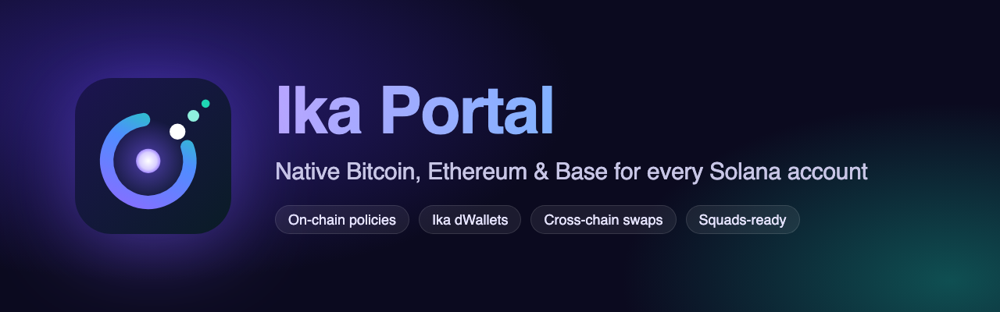
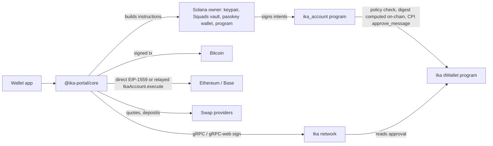

<p align="center"></p>

# Ika Portal

Give every Solana account a native **Bitcoin**, **Ethereum** and **Base** address, controlled by that Solana account. Ika dWallets hold the keys on the other chains; a Solana program decides what they sign.

For wallets (Phantom, Backpack, Solflare, custodians…) this means:

- **Native BTC + EVM addresses for any Solana account.** That includes keypairs, **Squads vaults**, passkey smart wallets and programs, with no special code.
- **Policies enforced on-chain:** spending limits, recipient allowlists, delays above a threshold, fee caps, and delayed policy changes.
- **Cross-chain swaps** through a provider router: NEAR Intents 1Click, Relay and LI.FI, with integrator fees.
- **Three key modes**, each trading recoverability against policy enforcement, plus a public or zero-trust (encrypted) user share.

**📚 Docs: [ika-portal-docs.vercel.app](https://ika-portal-docs.vercel.app)** · **🪪 Demo wallet: [ika-portal-wallet.vercel.app](https://ika-portal-wallet.vercel.app)** · Markdown sources: [docs/](docs/README.md)

 ([Getting started](docs/getting-started.md) · [Concepts](docs/concepts.md) · [Browser](docs/guides/browser.md) · [Squads](docs/guides/pda-owners.md) · [Swaps](docs/guides/swaps.md) · [API](docs/reference/api.md) · [Errors](docs/reference/errors.md))

> Testnet / devnet only. The Ika Solana pre-alpha uses a single mock signer, not real MPC. See [Security & trust model](docs/security.md).



The owner signs a structured **intent** (send X of asset Y to Z). The program checks policy and **computes every digest itself** from the intent fields (EIP-1559, EIP-712, EIP-7702, BIP143), then CPI-approves it on Ika. Ika signs only approved digests, and the SDK broadcasts. Clients never submit raw digests.

## Quick start for wallets

```ts
import { Connection } from '@solana/web3.js';
import { IkaPortal, defaultPolicy } from '@ika-portal/core';
import { IkaPreAlphaSigner, SolanaSignatureUnlocker } from '@ika-portal/signer';
import { btc, USDC } from '@ika-portal/chains';

const connection = new Connection('https://api.devnet.solana.com', 'confirmed');
const ika = new IkaPortal({
  connection,
  signer: new IkaPreAlphaSigner({ connection, identity: sessionKeypair }), // gRPC-web in browsers
  unlocker: new SolanaSignatureUnlocker((m) => wallet.signMessage(m)),    // encrypted (zero-trust) shares
  wallet,                                                                  // { publicKey, signTransaction }
  chains: {
    bitcoin: { network: 'testnet', backend: new btc.EsploraBackend('https://mempool.space/testnet4/api') },
    ethereum: { rpc: SEPOLIA_RPC, chainId: 11155111, tokens: { USDC: USDC.sepolia } },
    base: { rpc: BASE_SEPOLIA_RPC, chainId: 84532, tokens: { USDC: USDC.baseSepolia } },
  },
  relayerUrl,                                   // optional: gasless EVM (EIP-7702)
  swap: { providers: [nearIntents, relay], fees: { integrator: { recipient: FEE_ADDR, bps: 30 } } },
});

// Create: returns secrets once; the SDK never stores them. Persist `dwallets`.
const { account, mnemonic, recoveryKey, dwallets } = await ika.createAccount({
  owner: wallet.publicKey,
  mode: 'enforced_recovery',   // 'recoverable' | 'enforced' | 'enforced_recovery'
  userShare: 'encrypted',      // 'public' | 'encrypted'
  policy: defaultPolicy({ limits: [{ chain: 'base', asset: 'USDC', maxPerWindow: 1_000_000_000n, windowS: 86_400 }] }),
  recovery: { csvBlocks: 6, evmDelayS: 3600 },
});

account.addresses;        // { bitcoin: 'tb1q…', ethereum: '0x…', base: '0x…' }
await account.balances();

// Send: preview the policy, then follow progress.
const p = await account.prepareTransfer('send', { chain: 'base', asset: 'USDC', to, amount: 5_000_000n });
account.checkPolicy(p);   // { ok: true, delayed, executableAt } | { ok: false, error: 'LimitExceeded', message }
const intent = await account.send({ chain: 'base', asset: 'USDC', to, amount: 5_000_000n });
for await (const s of intent.progress()) console.log(s.status); // proposed → approved → signed → broadcast → confirmed

// Swap BTC → USDC on Base (best quote, integrator fees, delivered to the account's own address)
const { best } = await account.quoteSwap({ from: { chain: 'bitcoin', asset: 'BTC', amount: 1_000_000n }, to: { chain: 'base', asset: 'USDC' } });
await (await account.swap(best!)).wait();

// Policy changes land after `policyChangeDelayS`
await account.proposePolicy(next);
await account.applyPolicy();

// Squads and other PDA owners: build instructions, don't send
const ixs = await account.instructions.send({ chain: 'ethereum', asset: 'ETH', to, amount });
// …execute ixs in a Squads vault transaction; the SDK continues from approve_intent:
await account.intent(pdaCapturedBefore).wait();
```

EVM accounts work in two modes:
- **direct** (default): the dWallet EOA signs and pays for its own EIP-1559 transactions. No contract or relayer.
- **delegated**: after `account.setupEvm(chain)`, the EOA is EIP-7702-delegated to `IkaAccount.sol` and sends are relayed. It holds no ETH and gets on-chain recovery for `enforced_recovery`.

## Modes

| Mode | Keys | Policy | Recovery without Ika |
| --- | --- | --- | --- |
| `recoverable` | BIP39 mnemonic on device (`m/84'/…` BTC, `m/44'/60'/…` EVM), imported into dWallets | Only on the dWallet path; the mnemonic bypasses it | Mnemonic in any standard wallet |
| `enforced` | Ika DKG; no full key ever exists | Absolute | None |
| `enforced_recovery` | Ika DKG + a recovery key kept by the user | Absolute until the recovery delay | BTC: P2WSH CSV branch; EVM: `IkaAccount` recovery |

`userShare: 'encrypted'` means the owner's device (Solana signature or passkey) must unlock the share for every signature. PDA owners must use `public`; the program enforces this.

## Repository

```
programs/ika_account/     Anchor program: accounts, intents, policy engine, on-chain digests, Ika CPI
programs/mock_dwallet/    Local stand-in for the Ika dWallet program (same wire format)
programs/test_cpi_owner/  Test PDA owner (Squads stand-in)
contracts/evm/            IkaAccount.sol (EIP-7702 delegate) + Foundry tests
packages/core/            IkaPortal client, accounts, intents, policy preview
packages/chains/          EVM + Bitcoin builders, adapters, backends, offline recovery tools
packages/signer/          SignerBackend, IkaPreAlphaSigner, LocalMockSigner, share unlockers
packages/swap/            SwapProvider, router, NEAR Intents 1Click, Relay, LI.FI, mock
services/relayer/         EVM gas relayer (delegated mode)
apps/example-wallet/      Vite + React demo wallet
tests/e2e/                Local end-to-end suites (validator, anvil, bitcoind)
scripts/                  devnet-e2e.ts, squads-devnet.ts, sync-idl.sh
```

## Devnet

| | |
| --- | --- |
| `ika_account` | `Dx7P74pmeMqgPG4iF3VpL5aZ6TZTMiPzcMULnpu2hyje` (Solana devnet) |
| Ika dWallet program | `87W54kGYFQ1rgWqMeu4XTPHWXWmXSQCcjm8vCTfiq1oY` |
| Ika gRPC | `pre-alpha-dev-1.ika.ika-network.net:443` (gRPC and gRPC-web) |

```bash
pnpm tsx scripts/devnet-e2e.ts      # DKG → approve via Ika CPI → Ika sign (BROADCAST=1 to broadcast when funded)
pnpm tsx scripts/squads-devnet.ts   # Squads v4 vault owns an account and sends through vault transactions
pnpm test:hybrid                    # real Ika devnet signing → transactions on local Docker EVM/Bitcoin chains
```

## Development

Requires Rust (stable), Anchor 1.2, Solana CLI 4.x, Foundry, Bitcoin Core, Node 24, pnpm.

```bash
pnpm install
pnpm build:programs    # anchor build + sync IDL into packages/core
pnpm test:programs     # LiteSVM: every policy rule / error code, delays, PDA owners
pnpm test:contracts    # Foundry: IkaAccount.sol
pnpm test              # unit: chains parity vs viem/bitcoinjs, swap router/providers
pnpm test:e2e          # local: solana-test-validator + anvil (Prague) + bitcoind regtest

# or with Docker (no local Solana/Foundry/Bitcoin Core needed):
pnpm stack:up && pnpm test:e2e:docker
pnpm typecheck
```

The e2e suite covers:
- on-chain digest parity vs viem `hashTypedData` / `hashAuthorization` / EIP-1559 and bitcoinjs `hashForWitnessV0`;
- direct and relayed EVM sends, EIP-7702 setup, and on-chain policy errors;
- EVM recovery (initiate / cancel / execute);
- the encrypted-share lock;
- BTC P2WPKH / P2WSH sends and the CSV recovery boundary;
- mnemonic restore;
- a BTC → Base USDC swap through the router.

## License

[BSD-3-Clause-Clear](LICENSE). See [SECURITY.md](SECURITY.md) to report vulnerabilities.
